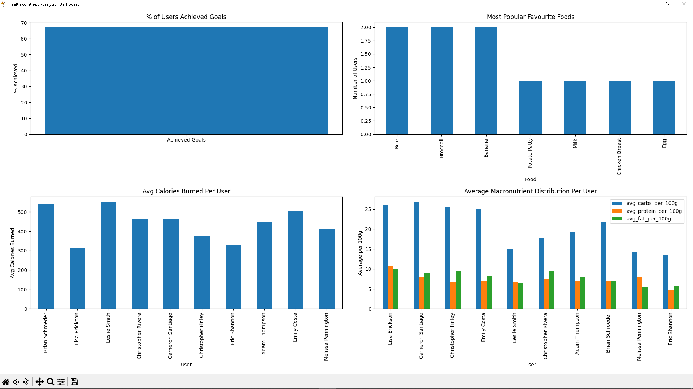
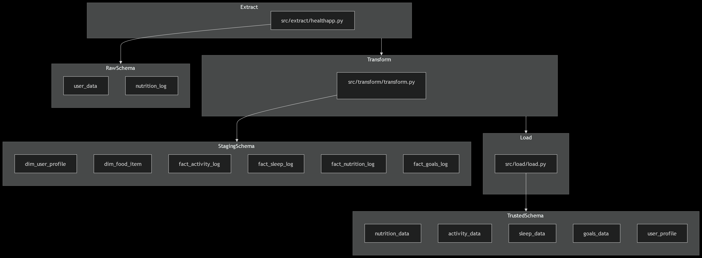
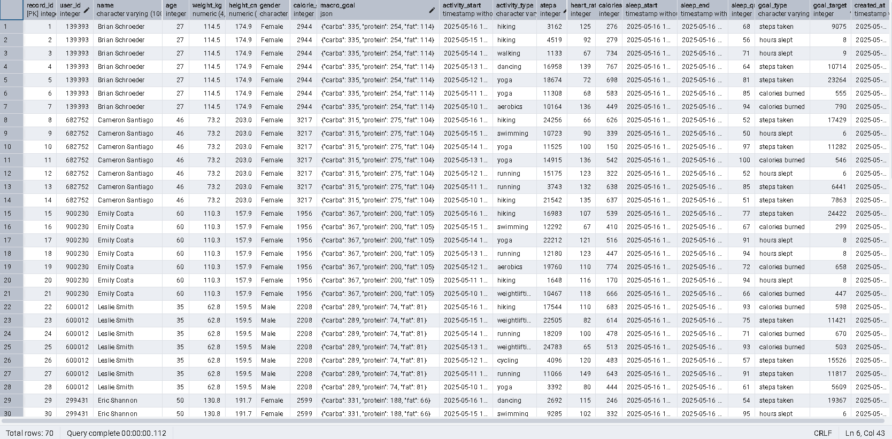
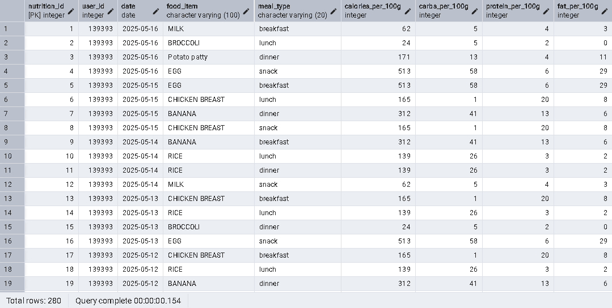
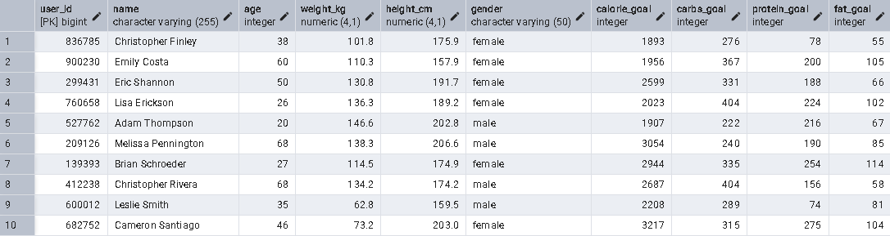
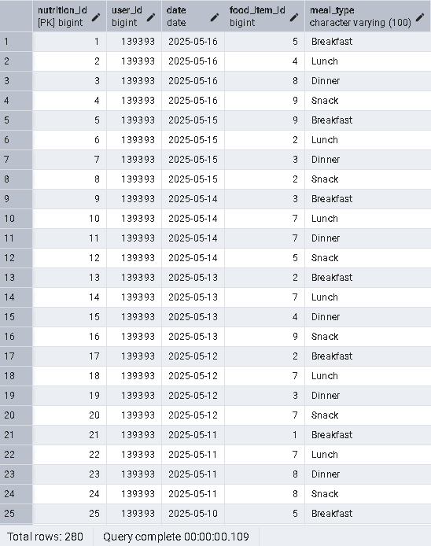
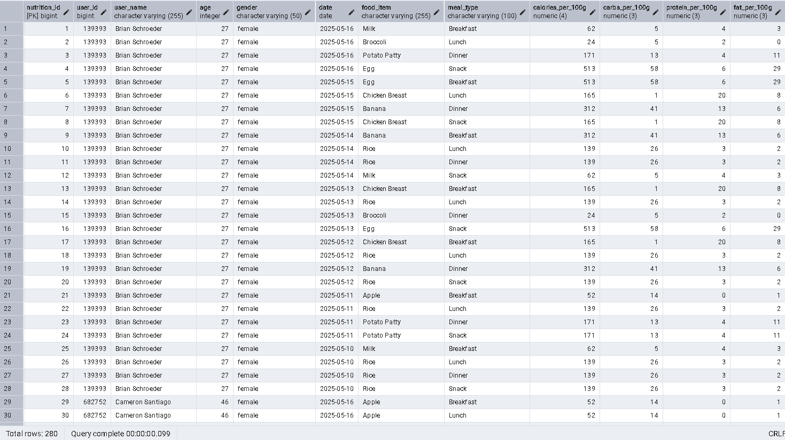
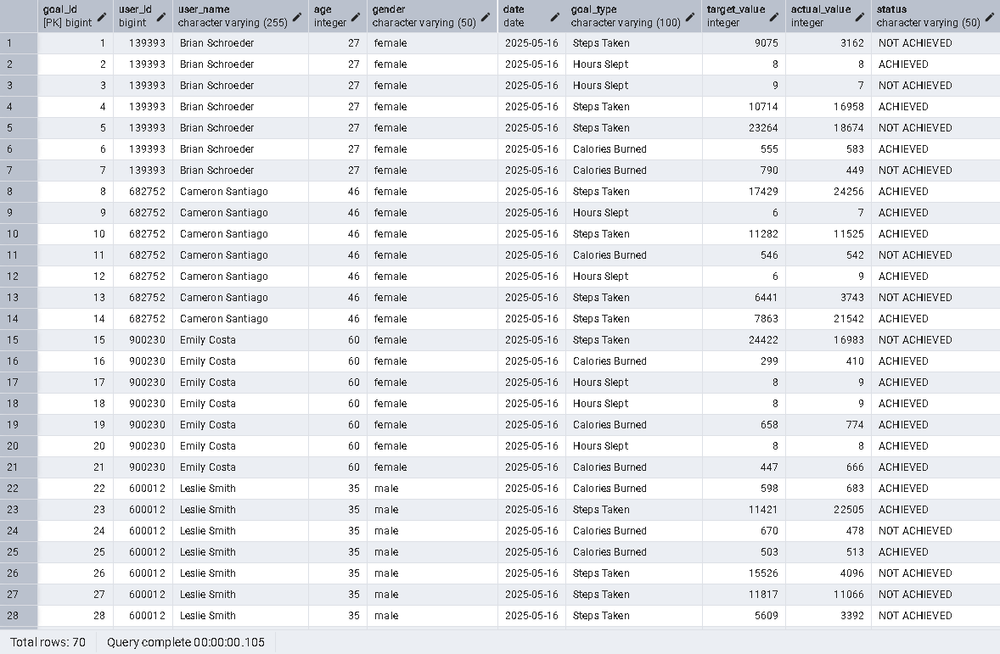

# Data Warehousing Project:<br/> Health, Fitness & Nutrition Analytics

This project is a comprehensive data warehousing solution designed for a hypothetical health-tech startup.<br>
It demonstrates best practices in ETL, data governance, privacy, and analytics with interactive dashboards and role-based access control.

---

## Table of contents
1. [Description](#1-description)
2. [Business Requirements & Goals](#2-business-requirements--goals)
3. [Reports, Dashboards & KPIs](#3-reports-dashboards--kpis)
    - [Dashboard Example Output](#dashboard-example-output)
4. [Data Warehouse Design, Tables & Sources](#4-data-warehouse-design-tables--sources)<br>
   4.1 [APIs and Data Sources](#41-apis-and-data-sources)<br>
   4.2 [ETL Process](#42-etl-process)<br>
   4.3 [Schemas](#43-schemas)<br>
      - [Raw Schema](#raw-schema)<br>
      - [Staging Schema](#staging-schema)<br>
      - [Trusted Schema](#trusted-schema)<br>
5. [Database Administration & Data Governance](#5-database-administration--data-governance)
    - [5.1 Database Administration](#51-database-administration)<br>
    - [5.2 Data Governance](#52-data-governance)<br>

---

## 1. Description

This repository showcases an end-to-end data warehouse solution designed for a fictional health-tech startup.<br>
The scenario centers on a mobile application that helps users monitor their health and wellness by tracking activity, sleep, and nutrition data, with a data engineer responsible for building and maintaining the pipelines that enable secure, reliable analysis of this information.

The project demonstrates how to:
- Integrate and process data from multiple sources (including synthetic data and public APIs).
- Implement robust ETL pipelines for cleaning, validating, and transforming raw data into analytics-ready tables.
- Enforce strong data governance, privacy, and security practices, including the separation of PII and non-PII data.
- Provide interactive dashboards and key performance indicators (KPIs) for user activity, sleep, nutrition, and goal achievement.
- Apply role-based access control to protect sensitive data.

> **Note:**  
> This project is for educational and demonstration purposes only. The app and its data are entirely fictional and intended to showcase best practices in data engineering, warehousing, and analytics.

---

## 2. Business Requirements & Goals

### Business Requirements 
- Integrate and process user health data (activity, sleep, nutrition) from multiple sources.
- Ensure data privacy by separating and protecting PII and non-PII data.
- Maintain high data quality and secure, role-based access.
- Support analytics and reporting with trusted, well-structured data.

### Core Business Goals 
- Provide actionable insights on user health and goal achievement.
- Demonstrate best practices in data governance and lifecycle management.
- Enable interactive dashboards and KPIs for key health metrics.

---

## 3. Reports, Dashboards & KPIs

> **Note:**  
> Before generating dashboards, you must first extract, transform, and load the data by running the following scripts in order:  
> 1. [`src/extract/healthapp.py`](src/extract/healthapp.py)  
> 2. [`src/transform/transform.py`](src/transform/transform.py)  
> 3. [`src/load/load.py`](src/load/load.py)

Interactive dashboards can be generated by running the provided script: 
```bash
python src/dashboard/dashboard.py
```
This script ([`src/dashboard/dashboard.py`](src/dashboard/dashboard.py)) automatically creates and visualizes dashboards for your key health and fitness metrics using the [trusted views](sql/business_view/).

**Dashboards and KPIs included:**

- **Goal Achievement:**  
  - % of users who have achieved their goals  
    - [`trusted.vw_pct_users_achieved_goals`](sql/business_view/create_view_pct_users_achieved_goals.sql): Calculates the percentage of user goals (across all goal types) that have been achieved.

- **Nutrition:**  
  - User's favourite food and typical meal time  
    - [`trusted.vw_user_favourite_food`](sql/business_view/create_view_user_favourite_food.sql): Shows each user's most frequently consumed food and the meal time they usually eat it.
  - Average macronutrient distribution per user  
    - [`trusted.vw_user_avg_macros`](sql/business_view/create_view_user_avg_macros.sql): Displays the average intake of calories, carbs, protein, and fat per user.

- **Activity:**  
  - Daily average calories burned per user  
    - [`trusted.vw_user_daily_avg_calories_burned`](sql/business_view/create_view_avg_calories_burned.sql): Reports the average number of calories burned per user per day.

- **All dashboards:**  
  - Displayed together for easy comparison

<details>
<summary id="dashboard-example-output">Dashboard Example Output</summary>

  
*Dashboard example shown for 10 generated users across 7 days*

</details>

---

## 4. Data Warehouse Design, Tables & Sources

### 4.1 APIs and Data Sources

- **HealthApp**: Synthetic data is generated using the [`healthapp.py`](src/extract/healthapp.py) script.  
  - To generate raw data, run the following command:
    ```bash
    python src/extract/healthapp.py
    ```
  - This script creates the necessary schemas and tables in the `raw` schema (if they do not already exist) and populates them with raw user data (see [`raw.user_data`](#rawuserdata)), for activity, sleep, nutrition, and goals.  
- [**USDA API**](https://www.ers.usda.gov/developer/data-apis/): Nutritional data for food items is fetched dynamically via API calls within the [`healthapp.py`](src/extract/healthapp.py) script.  

---

## 4.2 ETL Process

<details>
<summary>Show ETL Pipeline Diagram</summary>

  
*Overview of the ETL pipeline: Extract, Transform, Load.*

</details>
<br>
The ETL pipeline consists of the following stages, each with a dedicated script:

### 1. **Extract**
- **Purpose:** Generate and collect raw data from synthetic sources and public APIs.
- **Code:** [`src/extract/healthapp.py`](src/extract/healthapp.py)
  - Generates synthetic user/activity/nutrition data and loads it into the `raw` schema.
  - **Tables created in `raw` schema:**
    - [`raw.user_data`](sql/tables/raw/create_raw_user_data_table.sql)
    - [`raw.nutrition_log`](sql/tables/raw/create_raw_nutrition_log_table.sql)
- **Supporting code:**
  - [`src/extract/search_foods_api.py`](src/extract/search_foods_api.py): Fetches nutrition data from the USDA API.
  - [`src/extract/load_data_from_csv.py`](src/extract/load_data_from_csv.py): Loads food and activity types from CSV files.
- **How to run:**
  ```sh
  python src/extract/healthapp.py
  ```
<details>
<summary>Show Sample Raw User Data</summary>

  
*Example of the `raw.user_data` table as generated by the extract script.*

</details>

<details>
<summary>Show Sample Raw Nutrition Log</summary>

  
*Example of the `raw.nutrition_log` table as generated by the extract script.*

</details>

---

### 2. **Transform**
- **Purpose:** Clean, validate, and transform raw data into analytics-ready staging tables.
- **Code:** [`src/transform/transform.py`](src/transform/transform.py)
  - Reads from the `raw` schema, processes the data, and loads it into the `staging` schema.
  - **Tables created in `staging` schema:**
    - [`staging.dim_user_profile`](sql/tables/staging/create_dim_user_profile_table.sql)
    - [`staging.dim_food_item`](sql/tables/staging/create_dim_food_item_table.sql)
    - [`staging.fact_activity_log`](sql/tables/staging/create_fact_activity_log_table.sql)
    - [`staging.fact_sleep_log`](sql/tables/staging/create_fact_sleep_log_table.sql)
    - [`staging.fact_nutrition_log`](sql/tables/staging/create_fact_nutrition_log_table.sql)
    - [`staging.fact_goals_log`](sql/tables/staging/create_fact_goals_log_table.sql)
- **How to run:**
  ```sh
  python src/transform/transform.py
  ```
<details>
<summary>Show Sample Staging User Profile</summary>

  
*Example of the `staging.dim_user_profile` table after transformation.*

</details>

<details>
<summary>Show Sample Staging Nutrition Log</summary>

  
*Example of the `staging.fact_nutrition_log` table after transformation.*

</details>

---

### 3. **Load**
- **Purpose:** Load fully processed data from staging into the trusted schema for analytics and reporting.
- **Code:** [`src/load/load.py`](src/load/load.py)
  - Moves data from the `staging` schema into the `trusted` schema, enforcing all business and data quality rules.
  - **Tables created in `trusted` schema:**
    - [`trusted.nutrition_data`](sql/tables/trusted/create_trusted_nutrition_data_table.sql)
    - [`trusted.sleep_data`](sql/tables/trusted/create_trusted_sleep_data_table.sql)
    - [`trusted.activity_data`](sql/tables/trusted/create_trusted_activity_data_table.sql)
    - [`trusted.goals_data`](sql/tables/trusted/create_trusted_goals_data_table.sql)
- **How to run:**
  ```sh
  python src/load/load.py
  ```

> **Note:**  
> Each script will automatically create the required tables in its schema if they do not already exist.

<details>
<summary>Show Sample Trusted Nutrition</summary>

  
*Example of the `trusted.nutrition_data` table after loading.*

</details>

<details>
<summary>Show Sample Trusted Activity</summary>

  
*Example of the `trusted.activity_data` table after loading.*

</details>

---

### 4.3 Schemas

The data warehouse is organized into three schemas: **raw**, **staging**, and **trusted**. Each schema serves a specific purpose in the ETL pipeline:

#### Raw Schema
- **Purpose**: The initial storage for raw, unprocessed data directly extracted from the sources.  

#### `raw.user_data`
| Column Name       | Data Type     | Description                                      |
|-------------------|--------------|--------------------------------------------------|
| `record_id`       | `SERIAL PRIMARY KEY`  | Unique identifier for each record.      |
| `user_id`         | `INTEGER`    | Unique identifier for the user.                 |
| `name`            | `VARCHAR(100)` | User's name.                                   |
| `age`             | `INTEGER`    | User's age.                                     |
| `weight_kg`       | `NUMERIC(4,1)` | User's weight in kilograms.                    |
| `height_cm`       | `NUMERIC(4,1)` | User's height in centimeters.                  |
| `gender`          | `VARCHAR(10)` | User's gender.                                  |
| `calorie_goal`    | `INTEGER`    | Daily calorie goal for the user.                |
| `macro_goal`      | `JSON`       | JSON object containing macro goals (carbs, protein, fat). |
| `activity_start`  | `TIMESTAMP`  | Start time of the activity.                     |
| `activity_type`   | `VARCHAR(50)` | Type of activity (e.g., walking, running).      |
| `steps`           | `INTEGER`    | Daily step count                                |
| `heart_rate`      | `INTEGER`    | Heart rate during the activity.                 |
| `calories_burned` | `INTEGER`    | Calories burned during the day.                 |
| `sleep_start`     | `TIMESTAMP`  | Start time of sleep.                            |
| `sleep_end`       | `TIMESTAMP`  | End time of sleep.                              |
| `sleep_quality_score` | `INTEGER` | Quality score of sleep.                         |
| `goal_type`       | `VARCHAR(50)` | Type of goal (e.g., calories burned, steps taken). |
| `goal_target`     | `INTEGER`    | Target value for the goal.                      |
| `created_at`      | `TIMESTAMP`  | Timestamp when the record was created.          |

#### `raw.nutrition_log`
| Column Name       | Data Type     | Description                                      |
|-------------------|--------------|--------------------------------------------------|
| `nutrition_id`    | `SERIAL PRIMARY KEY` | Unique identifier for the nutrition record.  |
| `user_id`         | `INTEGER`     | Unique identifier for the user.                 |
| `date`            | `DATE`       | Date of the nutrition log.                      |
| `food_item`       | `VARCHAR(255)` | Name of the food item.                         |
| `meal_type`       | `VARCHAR(100)` | Type of meal (e.g., breakfast, lunch).         |
| `calories_per_100g` | `INTEGER` | Calories per 100 grams of the food item.     |
| `carbs_per_100g`  | `INTEGER` | Carbohydrates per 100 grams of the food item. |
| `protein_per_100g` | `INTEGER` | Protein per 100 grams of the food item.       |
| `fat_per_100g`    | `INTEGER` | Fat per 100 grams of the food item.           |

---

#### Staging Schema
- **Purpose**: Stores cleaned and transformed data, ready for further processing.  

#### `staging.dim_user_profile`
| Column Name       | Data Type     | Description                                      |
|-------------------|--------------|--------------------------------------------------|
| `user_id`         | `BIGINT PRIMARY KEY`     | Unique identifier for the user.      |
| `name`            | `VARCHAR(255)` | User's name.                                   |
| `age`             | `INTEGER`    | User's age.                                     |
| `weight_kg`       | `DECIMAL(4,1)` | User's weight in kilograms.                    |
| `height_cm`       | `DECIMAL(4,1)` | User's height in centimeters.                  |
| `gender`          | `VARCHAR(50)` | User's gender.                                  |
| `calorie_goal`    | `INTEGER`    | Daily calorie goal for the user.                |
| `carbs_goal`      | `INTEGER`    | Daily carbohydrate goal for the user.           |
| `protein_goal`    | `INTEGER`    | Daily protein goal for the user.                |
| `fat_goal`        | `INTEGER`    | Daily fat goal for the user.                    |

#### `staging.dim_food_item`
| Column Name       | Data Type     | Description                                      |
|-------------------|--------------|--------------------------------------------------|
| `food_item_id`    | `BIGINT PRIMARY KEY`     | Unique identifier for the food item.        |
| `food_item`       | `VARCHAR(255)` | Name of the food item.                         |
| `calories_per_100g` | `DECIMAL(4,0)` | Calories per 100 grams of the food item.     |
| `carbs_per_100g`  | `DECIMAL(3,0)` | Carbohydrates per 100 grams of the food item. |
| `protein_per_100g` | `DECIMAL(3,0)` | Protein per 100 grams of the food item.       |
| `fat_per_100g`    | `DECIMAL(3,0)` | Fat per 100 grams of the food item.           |

#### `staging.fact_activity_log`
| Column Name       | Data Type     | Description                                      |
|-------------------|--------------|--------------------------------------------------|
| `activity_id`     | `BIGINT PRIMARY KEY`     | Unique identifier for the activity record. |
| `user_id`         | `BIGINT`     | Unique identifier for the user.                 |
| `timestamp`       | `TIMESTAMP`  | Timestamp of the activity.                      |
| `activity_type`   | `VARCHAR(100)` | Type of activity (e.g., walking, running).     |
| `steps`           | `INTEGER`    | Number of steps taken during the activity.      |
| `heart_rate`      | `INTEGER`    | Heart rate during the activity.                 |
| `calories_burned` | `INTEGER`    | Calories burned during the activity.            |

#### `staging.fact_sleep_log`
| Column Name       | Data Type     | Description                                      |
|-------------------|--------------|--------------------------------------------------|
| `sleep_id`        | `BIGINT PRIMARY KEY`     | Unique identifier for the sleep record. |
| `user_id`         | `BIGINT`     | Unique identifier for the user.                 |
| `date`            | `DATE`       | Date of the sleep record.                       |
| `sleep_start`     | `TIMESTAMP`  | Start time of sleep.                            |
| `sleep_end`       | `TIMESTAMP`  | End time of sleep.                              |
| `sleep_duration_hours` | `DECIMAL(5,1)` | Duration of sleep in hours.                  |
| `sleep_quality_score` | `INTEGER` | Quality score of sleep.                         |

#### `staging.fact_nutrition_log`
| Column Name       | Data Type     | Description                                      |
|-------------------|--------------|--------------------------------------------------|
| `nutrition_id`    | `BIGINT PRIMARY KEY`     | Unique identifier for the nutrition record. |
| `user_id`         | `BIGINT`     | Unique identifier for the user.                 |
| `date`            | `DATE`       | Date of the nutrition log.                      |
| `food_item_id`    | `BIGINT`     | Foreign key to the food item dimension.         |
| `meal_type`       | `VARCHAR(100)` | Type of meal (e.g., breakfast, lunch).         |

#### `staging.fact_goals_log`
| Column Name       | Data Type     | Description                                      |
|-------------------|--------------|--------------------------------------------------|
| `goal_id`         | `BIGINT PRIMARY KEY`     | Unique identifier for the goal record.|
| `user_id`         | `BIGINT`     | Unique identifier for the user.                 |
| `date`            | `DATE`       | Date of the goal record.                        |
| `goal_type`       | `VARCHAR(100)` | Type of goal (e.g., calories burned, steps taken). |
| `target_value`    | `INTEGER`    | Target value for the goal.                      |
| `actual_value`    | `INTEGER`    | Actual value achieved for the goal.             |
| `status`          | `VARCHAR(50)` | Status of the goal (e.g., achieved, not achieved). |

--- 

#### Trusted Schema
- **Purpose**: Stores the final, fully processed data that is ready for analytics and reporting.  

#### `trusted.nutrition_data`
| Column Name         | Data Type        | Description                                      |
|---------------------|-----------------|--------------------------------------------------|
| `nutrition_id`      | `BIGINT PRIMARY KEY` | Unique identifier for the nutrition record. |
| `user_id`           | `BIGINT`        | Unique identifier for the user.                  |
| `user_name`         | `VARCHAR(255)`  | User's name.                                     |
| `age`               | `INT`           | User's age.                                      |
| `gender`            | `VARCHAR(50)`   | User's gender.                                   |
| `date`              | `DATE`          | Date of the nutrition log.                       |
| `food_item`         | `VARCHAR(255)`  | Name of the food item.                           |
| `meal_type`         | `VARCHAR(100)`  | Type of meal (e.g., breakfast, lunch).           |
| `calories_per_100g` | `DECIMAL(4,0)`  | Calories per 100 grams of the food item.         |
| `carbs_per_100g`    | `DECIMAL(3,0)`  | Carbohydrates per 100 grams of the food item.    |
| `protein_per_100g`  | `DECIMAL(3,0)`  | Protein per 100 grams of the food item.          |
| `fat_per_100g`      | `DECIMAL(3,0)`  | Fat per 100 grams of the food item.              |

#### `trusted.activity_data`
| Column Name         | Data Type        | Description                                      |
|---------------------|-----------------|--------------------------------------------------|
| `activity_id`       | `BIGINT PRIMARY KEY` | Unique identifier for the activity record.   |
| `user_id`           | `BIGINT`        | Unique identifier for the user.                  |
| `user_name`         | `VARCHAR(255)`  | User's name.                                     |
| `age`               | `INT`           | User's age.                                      |
| `gender`            | `VARCHAR(50)`   | User's gender.                                   |
| `timestamp`         | `TIMESTAMP`     | Timestamp of the activity.                       |
| `activity_type`     | `VARCHAR(100)`  | Type of activity (e.g., walking, running).       |
| `steps`             | `INT`           | Number of steps taken during the activity.       |
| `heart_rate`        | `INT`           | Heart rate during the activity.                  |
| `calories_burned`   | `INT`           | Calories burned during the activity.             |

#### `trusted.sleep_data`
| Column Name             | Data Type        | Description                                      |
|-------------------------|-----------------|--------------------------------------------------|
| `sleep_id`              | `BIGINT PRIMARY KEY` | Unique identifier for the sleep record.      |
| `user_id`               | `BIGINT`        | Unique identifier for the user.                  |
| `user_name`             | `VARCHAR(255)`  | User's name.                                     |
| `age`                   | `INT`           | User's age.                                      |
| `gender`                | `VARCHAR(50)`   | User's gender.                                   |
| `date`                  | `DATE`          | Date of the sleep record.                        |
| `sleep_start`           | `TIMESTAMP`     | Start time of sleep.                             |
| `sleep_end`             | `TIMESTAMP`     | End time of sleep.                               |
| `sleep_duration_hours`  | `DECIMAL(5,1)`  | Duration of sleep in hours.                      |
| `sleep_quality_score`   | `INTEGER`       | Quality score of sleep.                          |

#### `trusted.goals_data`
| Column Name         | Data Type        | Description                                      |
|---------------------|-----------------|--------------------------------------------------|
| `goal_id`           | `BIGINT PRIMARY KEY` | Unique identifier for the goal record.        |
| `user_id`           | `BIGINT`        | Unique identifier for the user.                  |
| `user_name`         | `VARCHAR(255)`  | User's name.                                     |
| `age`               | `INT`           | User's age.                                      |
| `gender`            | `VARCHAR(50)`   | User's gender.                                   |
| `date`              | `DATE`          | Date of the goal record.                         |
| `goal_type`         | `VARCHAR(100)`  | Type of goal (e.g., calories burned, steps).     |
| `target_value`      | `INT`           | Target value for the goal.                       |
| `actual_value`      | `INT`           | Actual value achieved for the goal.              |
| `status`            | `VARCHAR(50)`   | Status of the goal (e.g., achieved, not achieved).|

--- 

## 5. Database Administration & Data Governance

### 5.1 Database Administration

- **Create DBA Roles:**  
  - Use the scripts in [`sql/roles/`](sql/roles/) to create the `dba_role` and grant access to the `trusted` schema and its views:
    - [`grant_usage_trusted_schema.sql`](sql/roles/grant_usage_trusted_schema.sql)
    - [`grant_select_trusted_views.sql`](sql/roles/grant_select_trusted_views.sql)
    - [`grant_access_pii_data.sql`](sql/roles/grant_access_pii_data.sql) (restricts PII access to DBAs)
    - [`grant_access_non_pii_data.sql`](sql/roles/grant_access_non_pii_data.sql) (grants analytics access to non-PII data)
    - [`grant_access_archive_user_data_pii.sql`](sql/roles/grant_access_archive_user_data_pii.sql) (restricts archive access to DBAs)
- **Optimize DB Performance:**  
  - Use [`explain_query_execution.sql`](sql/roles/explain_query_execution.sql) to analyze and optimize query performance.
- **Schema Organization:**  
  - **Schema Organization:**  
  - All scripts for table creation, data insertion, archiving, and deletion are organized by data sensitivity in [`sql/data/`](sql/data/).

---

### 5.2 Data Governance

- **Data Privacy & PII Handling:**
  - PII data (e.g., user names, ages) is stored only in `trusted.user_data_pii` and managed via scripts in [`sql/data/pii/`](sql/data/pii/).
  - Non-PII data is stored in `trusted.user_data_non_pii` (see [`sql/data/non_pii/`](sql/data/non_pii/)), where user identifiers are hashed and ages are grouped.
  - Access to PII tables is strictly limited to users with the `dba_role`.
- **Data Lifecycle Management:**
  - Old or inactive records are archived using scripts in [`sql/data/archive/`](sql/data/archive/).
  - Archived records are deleted from the main tables only after successful archival, ensuring no data loss.
- **Data Quality Assurance:**
  - All trusted tables enforce strong data quality constraints (`NOT NULL`, `CHECK`, valid value lists) at the schema level.
  - ETL scripts filter out incomplete or invalid records before loading into trusted tables.
- **Security & Access Control:**
  - Role-based access is enforced at the schema and table level.
  - PII data is never exposed to analytics or reporting users.
- **Documentation:**
  - All scripts and policies are documented in this README for transparency and auditability.

---

