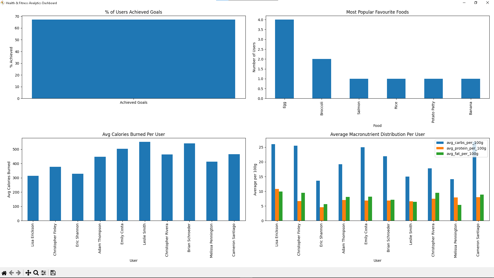

# Data Warehousing Project:<br/> Health, Fitness & Nutrition Analytics

## Table of contents
1. [Scenario](#1-scenario)
2. [Business Requirements & Goals](#2-business-requirements--goals)
3. [Reports, Dashboards & KPIs](#3-reports-dashboards--kpis)
4. [Data Warehouse Design, Tables & Sources](#4-data-warehouse-design-tables--sources)<br>
   4.1 [APIs and Data Sources](#41-apis-and-data-sources)<br>
   4.2 [ETL Process](#42-etl-process)<br>
   4.3 [Schemas](#43-schemas)<br>
      - [Raw Schema](#raw-schema)<br>
      - [Staging Schema](#staging-schema)<br>
      - [Trusted Schema](#trusted-schema)<br>

---

## 1. Scenario

You are a data engineer at a health-tech startup that develops a mobile app to monitor user health.<br>
It tracks activity, sleep, and nutrition data, providing real-time insights and analytics over time.

---

## 2. Business Requirements & Goals

### Business Requirements 
- Provide health analytics for users (nutrition,fitness,sleep).  
- Help users track progress toward personal goals.  
- Offer predictive insights into calorie balance and fitness level trends.  

### Core Business Goals 
- **Activity Monitoring** – Collect and visualize daily activity metrics (steps, heart rate, calories burned).  
- **Sleep Insights** – Track sleep duration and quality.  
- **Nutrition Tracking** – Monitor daily caloric intake and macro goals.  
- **Goal Adherence** – Analyze user behavior around set goals.  

---

## 3. Reports, Dashboards & KPIs

### Reports  
- Daily caloric intake vs goal  
- Macronutrient breakdown (carbs, fat, protein)  
- Exercise and calorie burn analysis  
- Weekly goal adherence (% of goals met)  
- Weight and BMI trends  

### Dashboards & KPIs

You can generate interactive dashboards by running the provided script:  
```bash
python src/dashboard/dashboard.py
```
This script automatically creates and visualizes dashboards for your key health and fitness metrics using the [trusted views](sql/business_view/).

**Dashboards and KPIs included:**

- **Goal Achievement:**  
  - % of users who have achieved their goals  
    - [`trusted.vw_pct_users_achieved_goals`](sql/business_view/create_view_pct_users_achieved_goals.sql): Calculates the percentage of user goals (across all goal types) that have been achieved.

- **Nutrition:**  
  - User's favourite food and typical meal time  
    - [`trusted.vw_user_favourite_food`](sql/business_view/create_view_user_favourite_food.sql): Shows each user's most frequently consumed food and the meal time they usually eat it.
  - Average macronutrient distribution per user  
    - [`trusted.vw_user_avg_macros`](sql/business_view/create_view_user_avg_macros.sql): Displays the average intake of calories, carbs, protein, and fat per user.

- **Activity:**  
  - Daily average calories burned per user  
    - [`trusted.vw_user_daily_avg_calories_burned`](sql/business_view/create_view_avg_calories_burned.sql): Reports the average number of calories burned per user per day.

- **All dashboards:**  
  - Displayed together for easy comparison

<details>
<summary>Example Dashboard Output</summary>

  
*Dashboard example shown for 10 generated users across 7 days*

</details>

---

## 4. Data Warehouse Design, Tables & Sources

### 4.1 APIs and Data Sources

- **HealthApp**: Synthetic data is generated using the `healthapp.py` script.  
  - To generate raw data, run the following command:
    ```bash
    python src/extract/healthapp.py
    ```
  - This script creates the necessary schemas and tables in the `raw` schema (if they do not already exist) and populates them with data for user profiles, activity logs, sleep logs, nutrition logs, and goals logs.  
- [**USDA API**](https://www.ers.usda.gov/developer/data-apis/): Nutritional data for food items is fetched dynamically via API calls within the `healthapp.py` script.  

---

### 4.2 ETL Process

The ETL pipeline consists of the following steps:

1. **Extract**:  
   - Data is extracted from the `HealthApp` and `USDA API`.  
   - The `healthapp.py` script handles the extraction of synthetic data and API calls.  

2. **Transform**:  
   - Data is cleaned and transformed using the `transform.py` script.  
   - To run the transformation process, use the following command:
     ```bash
     python src/transform/transform.py
     ```

3. **Load**:  
   - Transformed data is loaded into the `staging` and `trusted` schemas.  

---

### 4.3 Schemas

The data warehouse is organized into three schemas: **raw**, **staging**, and **trusted**. Each schema serves a specific purpose in the ETL pipeline:

#### Raw Schema
- **Purpose**: The initial storage for raw, unprocessed data directly extracted from the sources.  

#### `raw.user_data`
| Column Name       | Data Type     | Description                                      |
|-------------------|--------------|--------------------------------------------------|
| `record_id`       | `SERIAL PRIMARY KEY`  | Unique identifier for each record.      |
| `user_id`         | `INTEGER`    | Unique identifier for the user.                 |
| `name`            | `VARCHAR(100)` | User's name.                                   |
| `age`             | `INTEGER`    | User's age.                                     |
| `weight_kg`       | `NUMERIC(4,1)` | User's weight in kilograms.                    |
| `height_cm`       | `NUMERIC(4,1)` | User's height in centimeters.                  |
| `gender`          | `VARCHAR(10)` | User's gender.                                  |
| `calorie_goal`    | `INTEGER`    | Daily calorie goal for the user.                |
| `macro_goal`      | `JSON`       | JSON object containing macro goals (carbs, protein, fat). |
| `activity_start`  | `TIMESTAMP`  | Start time of the activity.                     |
| `activity_type`   | `VARCHAR(50)` | Type of activity (e.g., walking, running).      |
| `steps`           | `INTEGER`    | Daily step count                                |
| `heart_rate`      | `INTEGER`    | Heart rate during the activity.                 |
| `calories_burned` | `INTEGER`    | Calories burned during the day.                 |
| `sleep_start`     | `TIMESTAMP`  | Start time of sleep.                            |
| `sleep_end`       | `TIMESTAMP`  | End time of sleep.                              |
| `sleep_quality_score` | `INTEGER` | Quality score of sleep.                         |
| `goal_type`       | `VARCHAR(50)` | Type of goal (e.g., calories burned, steps taken). |
| `goal_target`     | `INTEGER`    | Target value for the goal.                      |
| `created_at`      | `TIMESTAMP`  | Timestamp when the record was created.          |

#### `raw.nutrition_log`
| Column Name       | Data Type     | Description                                      |
|-------------------|--------------|--------------------------------------------------|
| `nutrition_id`    | `SERIAL PRIMARY KEY` | Unique identifier for the nutrition record.  |
| `user_id`         | `INTEGER`     | Unique identifier for the user.                 |
| `date`            | `DATE`       | Date of the nutrition log.                      |
| `food_item`       | `VARCHAR(255)` | Name of the food item.                         |
| `meal_type`       | `VARCHAR(100)` | Type of meal (e.g., breakfast, lunch).         |
| `calories_per_100g` | `INTEGER` | Calories per 100 grams of the food item.     |
| `carbs_per_100g`  | `INTEGER` | Carbohydrates per 100 grams of the food item. |
| `protein_per_100g` | `INTEGER` | Protein per 100 grams of the food item.       |
| `fat_per_100g`    | `INTEGER` | Fat per 100 grams of the food item.           |

---

#### Staging Schema
- **Purpose**: Stores cleaned and transformed data, ready for further processing.  

#### `staging.dim_user_profile`
| Column Name       | Data Type     | Description                                      |
|-------------------|--------------|--------------------------------------------------|
| `user_id`         | `BIGINT PRIMARY KEY`     | Unique identifier for the user.      |
| `name`            | `VARCHAR(255)` | User's name.                                   |
| `age`             | `INTEGER`    | User's age.                                     |
| `weight_kg`       | `DECIMAL(4,1)` | User's weight in kilograms.                    |
| `height_cm`       | `DECIMAL(4,1)` | User's height in centimeters.                  |
| `gender`          | `VARCHAR(50)` | User's gender.                                  |
| `calorie_goal`    | `INTEGER`    | Daily calorie goal for the user.                |
| `carbs_goal`      | `INTEGER`    | Daily carbohydrate goal for the user.           |
| `protein_goal`    | `INTEGER`    | Daily protein goal for the user.                |
| `fat_goal`        | `INTEGER`    | Daily fat goal for the user.                    |

#### `staging.dim_food_item`
| Column Name       | Data Type     | Description                                      |
|-------------------|--------------|--------------------------------------------------|
| `food_item_id`    | `BIGINT PRIMARY KEY`     | Unique identifier for the food item.        |
| `food_item`       | `VARCHAR(255)` | Name of the food item.                         |
| `calories_per_100g` | `DECIMAL(4,0)` | Calories per 100 grams of the food item.     |
| `carbs_per_100g`  | `DECIMAL(3,0)` | Carbohydrates per 100 grams of the food item. |
| `protein_per_100g` | `DECIMAL(3,0)` | Protein per 100 grams of the food item.       |
| `fat_per_100g`    | `DECIMAL(3,0)` | Fat per 100 grams of the food item.           |

#### `staging.fact_activity_log`
| Column Name       | Data Type     | Description                                      |
|-------------------|--------------|--------------------------------------------------|
| `activity_id`     | `BIGINT PRIMARY KEY`     | Unique identifier for the activity record. |
| `user_id`         | `BIGINT`     | Unique identifier for the user.                 |
| `timestamp`       | `TIMESTAMP`  | Timestamp of the activity.                      |
| `activity_type`   | `VARCHAR(100)` | Type of activity (e.g., walking, running).     |
| `steps`           | `INTEGER`    | Number of steps taken during the activity.      |
| `heart_rate`      | `INTEGER`    | Heart rate during the activity.                 |
| `calories_burned` | `INTEGER`    | Calories burned during the activity.            |

#### `staging.fact_sleep_log`
| Column Name       | Data Type     | Description                                      |
|-------------------|--------------|--------------------------------------------------|
| `sleep_id`        | `BIGINT PRIMARY KEY`     | Unique identifier for the sleep record. |
| `user_id`         | `BIGINT`     | Unique identifier for the user.                 |
| `date`            | `DATE`       | Date of the sleep record.                       |
| `sleep_start`     | `TIMESTAMP`  | Start time of sleep.                            |
| `sleep_end`       | `TIMESTAMP`  | End time of sleep.                              |
| `sleep_duration_hours` | `DECIMAL(5,1)` | Duration of sleep in hours.                  |
| `sleep_quality_score` | `INTEGER` | Quality score of sleep.                         |

#### `staging.fact_nutrition_log`
| Column Name       | Data Type     | Description                                      |
|-------------------|--------------|--------------------------------------------------|
| `nutrition_id`    | `BIGINT PRIMARY KEY`     | Unique identifier for the nutrition record. |
| `user_id`         | `BIGINT`     | Unique identifier for the user.                 |
| `date`            | `DATE`       | Date of the nutrition log.                      |
| `food_item_id`    | `BIGINT`     | Foreign key to the food item dimension.         |
| `meal_type`       | `VARCHAR(100)` | Type of meal (e.g., breakfast, lunch).         |

#### `staging.fact_goals_log`
| Column Name       | Data Type     | Description                                      |
|-------------------|--------------|--------------------------------------------------|
| `goal_id`         | `BIGINT PRIMARY KEY`     | Unique identifier for the goal record.|
| `user_id`         | `BIGINT`     | Unique identifier for the user.                 |
| `date`            | `DATE`       | Date of the goal record.                        |
| `goal_type`       | `VARCHAR(100)` | Type of goal (e.g., calories burned, steps taken). |
| `target_value`    | `INTEGER`    | Target value for the goal.                      |
| `actual_value`    | `INTEGER`    | Actual value achieved for the goal.             |
| `status`          | `VARCHAR(50)` | Status of the goal (e.g., achieved, not achieved). |

--- 

#### Trusted Schema
- **Purpose**: Stores the final, fully processed data that is ready for analytics and reporting.  

#### `trusted.nutrition_data`
| Column Name         | Data Type        | Description                                      |
|---------------------|-----------------|--------------------------------------------------|
| `nutrition_id`      | `BIGINT PRIMARY KEY` | Unique identifier for the nutrition record. |
| `user_id`           | `BIGINT`        | Unique identifier for the user.                  |
| `user_name`         | `VARCHAR(255)`  | User's name.                                     |
| `age`               | `INT`           | User's age.                                      |
| `gender`            | `VARCHAR(50)`   | User's gender.                                   |
| `date`              | `DATE`          | Date of the nutrition log.                       |
| `food_item`         | `VARCHAR(255)`  | Name of the food item.                           |
| `meal_type`         | `VARCHAR(100)`  | Type of meal (e.g., breakfast, lunch).           |
| `calories_per_100g` | `DECIMAL(4,0)`  | Calories per 100 grams of the food item.         |
| `carbs_per_100g`    | `DECIMAL(3,0)`  | Carbohydrates per 100 grams of the food item.    |
| `protein_per_100g`  | `DECIMAL(3,0)`  | Protein per 100 grams of the food item.          |
| `fat_per_100g`      | `DECIMAL(3,0)`  | Fat per 100 grams of the food item.              |

#### `trusted.activity_data`
| Column Name         | Data Type        | Description                                      |
|---------------------|-----------------|--------------------------------------------------|
| `activity_id`       | `BIGINT PRIMARY KEY` | Unique identifier for the activity record.   |
| `user_id`           | `BIGINT`        | Unique identifier for the user.                  |
| `user_name`         | `VARCHAR(255)`  | User's name.                                     |
| `age`               | `INT`           | User's age.                                      |
| `gender`            | `VARCHAR(50)`   | User's gender.                                   |
| `timestamp`         | `TIMESTAMP`     | Timestamp of the activity.                       |
| `activity_type`     | `VARCHAR(100)`  | Type of activity (e.g., walking, running).       |
| `steps`             | `INT`           | Number of steps taken during the activity.       |
| `heart_rate`        | `INT`           | Heart rate during the activity.                  |
| `calories_burned`   | `INT`           | Calories burned during the activity.             |

#### `trusted.sleep_data`
| Column Name             | Data Type        | Description                                      |
|-------------------------|-----------------|--------------------------------------------------|
| `sleep_id`              | `BIGINT PRIMARY KEY` | Unique identifier for the sleep record.      |
| `user_id`               | `BIGINT`        | Unique identifier for the user.                  |
| `user_name`             | `VARCHAR(255)`  | User's name.                                     |
| `age`                   | `INT`           | User's age.                                      |
| `gender`                | `VARCHAR(50)`   | User's gender.                                   |
| `date`                  | `DATE`          | Date of the sleep record.                        |
| `sleep_start`           | `TIMESTAMP`     | Start time of sleep.                             |
| `sleep_end`             | `TIMESTAMP`     | End time of sleep.                               |
| `sleep_duration_hours`  | `DECIMAL(5,1)`  | Duration of sleep in hours.                      |
| `sleep_quality_score`   | `INTEGER`       | Quality score of sleep.                          |

#### `trusted.goals_data`
| Column Name         | Data Type        | Description                                      |
|---------------------|-----------------|--------------------------------------------------|
| `goal_id`           | `BIGINT PRIMARY KEY` | Unique identifier for the goal record.        |
| `user_id`           | `BIGINT`        | Unique identifier for the user.                  |
| `user_name`         | `VARCHAR(255)`  | User's name.                                     |
| `age`               | `INT`           | User's age.                                      |
| `gender`            | `VARCHAR(50)`   | User's gender.                                   |
| `date`              | `DATE`          | Date of the goal record.                         |
| `goal_type`         | `VARCHAR(100)`  | Type of goal (e.g., calories burned, steps).     |
| `target_value`      | `INT`           | Target value for the goal.                       |
| `actual_value`      | `INT`           | Actual value achieved for the goal.              |
| `status`            | `VARCHAR(50)`   | Status of the goal (e.g., achieved, not achieved).|

--- 

